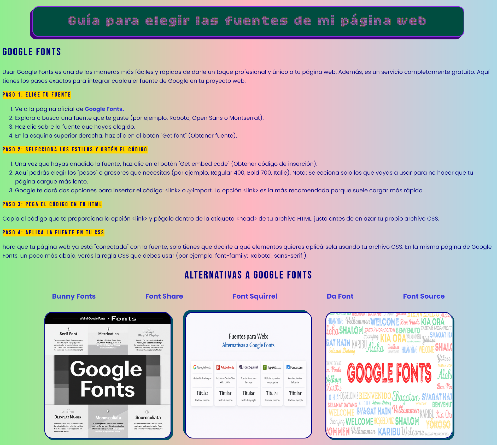

# 📝 Tarea 2: [Nombre del tema, ej. Estilizando nuestra primera página]

## 🎯 Objetivo
El objetivo de esta práctica es poner a prueba tus conocimientos de CSS. Deberás escribir los estilos necesarios para que la estructura del archivo `tarea2.html` se vea exactamente igual (o lo más parecido posible) al diseño original.

## 🖼️ Resultado Esperado
*Así es como debe lucir tu página web al terminar la tarea:*

*(Nota para el alumno: Intenta replicar los colores, espacios y tipografías que ves en esta imagen).*

## 🛠️ Instrucciones paso a paso
1. **Descarga el código:** Clona este repositorio en tu computadora o descarga el archivo ZIP.
2. **Prepara tu entorno:** Abre la carpeta en tu editor de código (por ejemplo, VS Code).
3. **Analiza el HTML:** Abre el archivo `tarea2.html`. **[Opcional: Agrega aquí si tienen permitido o no modificar el HTML para agregar clases/IDs]**.
4. **Crea tu hoja de estilos:** Crea un archivo nuevo llamado `tarea2.css` en la misma carpeta.
5. **Conecta los archivos:** Vincula tu nuevo archivo CSS dentro de la etiqueta `<head>` del documento HTML usando la etiqueta `<link>`.
6. **¡A programar!** Escribe todo tu código en el archivo `tarea2.css` basándote en la imagen de referencia.

## ✅ ¿Qué se evaluará?
Para obtener la calificación completa, revisaré los siguientes puntos:
* **Similitud visual:** Que los colores, márgenes (*margin* y *padding*) y alineaciones coincidan con el diseño esperado.
* **Uso correcto de selectores:** Aplicación adecuada de clases, IDs y selectores de etiqueta.
* **Código limpio:** Un CSS bien organizado, ordenado e indentado.
* **[Agrega otro criterio si lo deseas, ej. Uso de Flexbox, tipografías externas, etc.]**

## 📚 Recursos útiles
Si te atoras en algún paso, aquí tienes documentación que te puede ayudar:
* [Documentación de MDN sobre CSS](https://developer.mozilla.org/es/docs/Web/CSS)
* [Google Fonts](https://fonts.google.com/) (Para buscar las fuentes del proyecto)

---
**¡Mucho éxito y a codear! 🚀**
